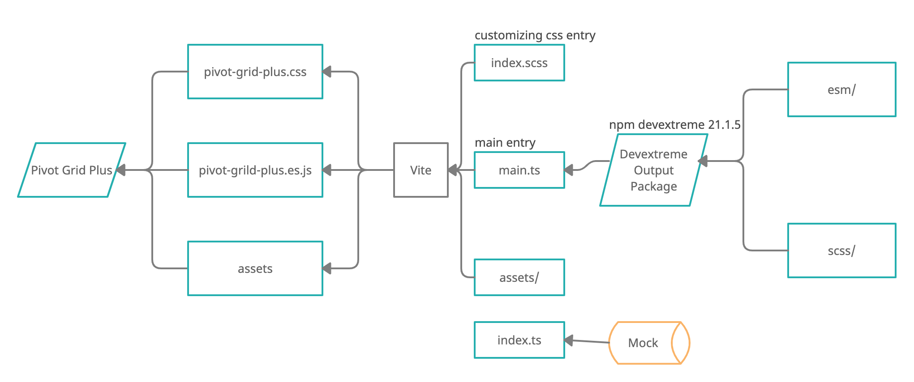

# Pivot Grid Plus

## 功能介绍

在 [DevExtreme Pivot Grid](https://js.devexpress.com/Documentation/ApiReference/UI_Components/dxPivotGrid/) 插件的基础上进行了二次开发， 在完全支持 DevExtreme 插件原有功能的基础上，通过二次开发更加符合了迦南云的应用需求场景。

## 管理方式

该包放在 gitlab 上管理，而 npm 上只发布编译后的文件

```bash
# 发布一个版本到 npm 上
# 该命令将会执行 npm run build && npm publish
# 将会把打包生成后的文件（含dist且不包含.npmignore文件中定义的文件） 目录发不到 npm 上
$ npm run publish
```

## UML



## 安装

```bash
$ npm install pivot-grid-plus
```

## 使用

开发模式

```bash
npm run serve
```

项目引用

```typescript
import { PivotGridPlus } from "pivot-grid-plus";

//  实例化
let P = new PivotGridPlus({
  el: document.getElementById("PivotBox"),
  //  ... 参数
});

//  调用方法
P.collapseAll();

//  绑定事件
P.instance().on("eventName", () => {
  //  ... handler
});
```

## 参数

### el

透视表所渲染所需的 DOM 容器

| 类型        | 默认值    | 描述                        |
| ----------- | --------- | --------------------------- |
| HTMLElement | undefined | 透视表所渲染所需的 DOM 容器 |

### expandAll

| 类型    | 默认值 | 描述             |
| ------- | ------ | ---------------- |
| boolean | true   | 默认是否展开全部 |

### dataFieldArea

| 类型           | 默认值 | 描述         |
| -------------- | ------ | ------------ |
| "column"/"row" | column | 字段显示位置 |

该值将会影响，当数据 Field 的 "area" 为 "data" 时， 表格显示的方式，

如果该值为 "column" 时， "data" 将会显示在 "column" 上

如果该值为 "row" 时， "data" 将会显示在 "row" 上

具体请产考 [dataFieldArea](https://js.devexpress.com/Documentation/ApiReference/UI_Components/dxPivotGrid/Configuration/#dataFieldArea)

### wordWrapEnabled

| 类型    | 默认值 | 描述                   |
| ------- | ------ | ---------------------- |
| boolean | false  | 在 td 中的文本是否换行 |

### dataSource

| 类型                       | 默认值    | 描述     |
| -------------------------- | --------- | -------- |
| PivotGridDataSourceOptions | undefined | 数据配置 |

具体请参考[dataSource](https://js.devexpress.com/Documentation/ApiReference/UI_Components/dxPivotGrid/Configuration/#dataSource)

### tdCustomStyle

| 类型                   | 默认值    | 描述                           |
| ---------------------- | --------- | ------------------------------ |
| TCustomStyleObj,string | undefined | 配置表格中 td 元素的自定义样式 |

通过此配置可以完成更为复杂的 td 样式关闭，比如在文本不换行的同时，进行溢出显示省略号。

```typescript
type TCustomStyleObj = {
  data: string | Partial<{}>;
  row: string | Partial<{}>;
  column: string | Partial<{}>;
  all: string | Partial<{}>;
  [key: string]: any;
};

//  配置共分3项
//  1. data 指的是 area 为 data 的字段
//  2. row 指的是 area 为 row 的字段
//  3. column 指的是 area 为 column 的字段

//  例子 1
//  以下样式将会应用于所有的 td
{
  tdCustomStyle: "text-align:center;color:#888;";
}

//  例子 2
//  所有td字体颜色都改为 #888，
//  但是只有 area 为 data 的字段文本居中显示
{
  tdCustomStyle:{
    all:"color:#888",
    data:"text-align:center;"
  }
}
```

### inheritHeight

| 类型    | 默认值 | 描述                           |
| ------- | ------ | ------------------------------ |
| boolean | false  | 透视表的高度是否继承父元素高度 |

### useBetterScroller

| 类型    | 默认值 | 描述                   |
| ------- | ------ | ---------------------- |
| boolean | true   | 是否使用自定义的滚动条 |

### emptyPlaceHolder

| 类型   | 默认值    | 描述                   |
| ------ | --------- | ---------------------- |
| string | undefined | 数据值为空时的站位文本 |

### summaryType

| 类型        | 默认值  | 描述       |
| ----------- | ------- | ---------- |
| summaryType | "count" | 统计的方式 |

```typescript
type summaryType = "sum" | "min" | "max" | "avg" | "count";
```

具体参考 [summaryType](https://js.devexpress.com/Documentation/ApiReference/Data_Layer/PivotGridDataSource/Configuration/fields/#summaryType)

`注：`该值是在内部已经实现接口，只需要在初始化时候传入就行了，它的基本行为也是修改 dataSource 里面的 fields 字段

### customFields

| 类型    | 默认值 | 描述         |
| ------- | ------ | ------------ |
| Field[] | []     | 自定义 field |

[Field 类型请参考这里](https://js.devexpress.com/Documentation/ApiReference/Data_Layer/PivotGridDataSource/Configuration/fields/)

该参数能在不修改原有的数据的基础上，额外增加用户自定义的字段配置

```typescript
//  下面这个例子，向表格中添加了一个自定义统计字段
new PivotGridPlus({
  //  ... 参数
  customFields: [
    {
      caption: "自定义统计",
      area: "data",
      calculateSummaryValue: function (e) {
        let cell = e.cell();
        let arrayLength = 6;
        if (cell) {
          let value =
            cell.slice(0, arrayLength).reduce((a, b) => a + b, 0) / arrayLength;
          return Math.trunc(value * 100) + "%";
        } else {
          return "null";
        }
      },
    },
  ],
});
```

### 额外参数

该插件基于 [DevExtreme Pivot Grid](https://js.devexpress.com/Documentation/ApiReference/UI_Components/dxPivotGrid/) 进行二次开发，
因此支持其所有配置

[点击查看参数列表](https://js.devexpress.com/Documentation/ApiReference/UI_Components/dxPivotGrid/Configuration/)

使用方式也较为简单，直接在实例化时候配置即可

```typescript
new PivotGridPlus({
  //  ... 其他参数
  //  下面这个参数就是来自于 DevExtreme Pivot Grid
  allowExpandAll: false,
});
```

## 方法

方法直接在实例化对象上使用即可

```typescript
let P = new PivotGridPlus();
P.updateOptions();
```

### updateOptions

| 接受参数 | 返回      | 描述     |
| -------- | --------- | -------- |
| Object   | undefined | 更新参数 |

```typescript
let P = new PivotGridPlus();
P.updateOptions({
  summaryType: "count",
  emptyPlaceHolder: "--",
  dataSource: newData,
});
```

### expandAll

| 接受参数  | 返回      | 描述         |
| --------- | --------- | ------------ |
| undefined | undefined | 展开所有字段 |

### collapseAll

| 接受参数  | 返回      | 描述         |
| --------- | --------- | ------------ |
| undefined | undefined | 收起所有字段 |

### destroy

| 接受参数  | 返回      | 描述     |
| --------- | --------- | -------- |
| undefined | undefined | 销毁实例 |

### 额外方法

该插件基于 [DevExtreme Pivot Grid](https://js.devexpress.com/Documentation/ApiReference/UI_Components/dxPivotGrid/) 进行二次开发，
因此支持其所有方法

[点击查看方法列表](https://js.devexpress.com/Documentation/ApiReference/UI_Components/dxPivotGrid/Methods/)

使用方式也较为简单，直接在实例化对象上调用即可

```typescript
let P = new PivotGridPlus();
//  下面这个方法就是来自于 DevExtreme Pivot Grid
P.getDataSource();
```

## 事件

```typescript
//  事件绑定方式有两种

//  1. 通过参数传递
let P = new PivotGridPlus({
  onCellClick(e) {
    //  todo something
  },
});

//  2. 通过实例对象绑定
P.instance().on("cellClick", () => {
  //  todo something
});
```

### 事件大全

该插件基于 [DevExtreme Pivot Grid](https://js.devexpress.com/Documentation/ApiReference/UI_Components/dxPivotGrid/) 进行二次开发，
因此支持其所有事件

[点击查看事件列表](https://js.devexpress.com/Documentation/ApiReference/UI_Components/dxPivotGrid/Events/)

## 项目结构

```markdown
📦pivot-grid-plus
┣ 📂build vite 功能配置，一般不需要改任何东西
┃ ┗ 📂vite
┃ ┃ ┗ 📂plugin
┃ ┃ ┃ ┣ 📜index.ts
┃ ┃ ┃ ┗ 📜mock.ts
┣ 📂mock mock.js 模拟数据，用于测试透视表功能 由 vite-plugin-mock 驱动
┃ ┣ 📂modules
┃ ┃ ┗ 📜api.ts
┃ ┗ 📜_createProductionServer.ts
┣ 📂public 资源文件夹，通过 npm run build 后会一并打包至 dist 目录
┃ ┗ 📂icons
┣ 📂src 主开发目录
┃ ┣ 📂@packages packages 包文件夹
┃ ┃ ┗ 📂devextreme devextreme 打包好后的文件夹， 这里只提取了 esm 和 scs 目录
┃ ┃ ┃ ┣ 📂esm devextreme 打包出来的 ES module 的 js 文件夹
┃ ┃ ┃ ┗ 📂scss devextreme 打包出来的 scss 文件
┃ ┣ 📂js 自定义功能 js 该文件夹存放非涉及二次开发的 js 文件
┃ ┣ 📂scss 自定义 scss 该文件夹存放非涉及二次开发的 scss 文件
┃ ┣ 📜index.ts 项目启动文件，该文件用于测试功能，并不用打包
┃ ┗ 📜main.ts 项目入口文件，该文件才是最终 dist 文件夹中打包好的 js 入口文件
┣ 📜.gitignore
┣ 📜index.html
┣ 📜package.json
┣ 📜tsconfig.json
┗ 📜vite.config.ts
```
